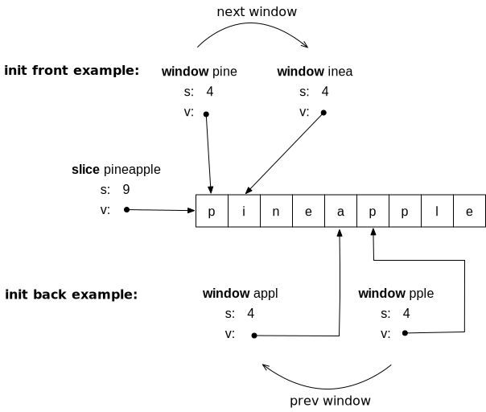

= window
:xmpldir: ../../../test/clingo/lang/window

//******************************************************************************
//******************************************************************** Overview
//******************************************************************************
== Overview

A window is a abstract struct that allows to itarate over multiple values of a
slice.
The subslices(windows) are overlapping.

A window struct can also be viewed as slice because it has the attributes *s*
(sequence length) and *v* (points to the first value).

In addition has a window an attribute *slice* for the actual slice.

This module defines code generation macros to generate typed window structs.
Also has this module macro functions to move a window struct along the slice
sequence.

//******************************************************************************
//****************************************************** Code Generation Macros
//******************************************************************************
== Code Generation Macros

//************************************************************************ init
=== init

[id='INIT_FRONT_WINDOW_C_']
==== INIT_FRONT_WINDOW_C_
[source,c]
----
#define INIT_FRONT_WINDOW_C_( FuncName, WindowType, SliceType )
----

Generates a initialization function that sets the *window* on the front of a
*slice*.
The parameter *s* defines the size of the window subslices.
The generated function has the following common signature:
[source,c]
----
void FuncName( WindowType window[static 1], int64_t s, SliceType slice );
----

[id='INIT_BACK_WINDOW_C_']
==== INIT_BACK_WINDOW_C_
[source,c]
----
#define INIT_BACK_WINDOW_C_( FuncName, WindowType, SliceType )
----

Generates a initialization function that sets the *window* on the back of a
*slice*.
The parameter *s* defines the size of the window subslices.
The generated function has the following common signature:
[source,c]
----
void FuncName( WindowType window[static 1], int64_t s, SliceType slice );
----

//************************************************************************ type
=== type

[id='WINDOW_DEF_C_']
==== WINDOW_DEF_C_
[source,c]
----
#define WINDOW_DEF_C_( Type,
                       WindowType, SliceType, FuncSuffix,
                       VarWindowType, VarSliceType, VarFuncSuffix )
----

Generates two window structs for slices with _Type_ values.
The struct _WindowType_ for the const sequence of _SliceType_ and
_VarWindowType_ for the variable sequence of _VarSliceType_.
The values _FuncSuffix_ and _VarFuncSuffix_ are used as postfix for the generated
inline functions.

The following call can be used in a .h or .c file.
[source,c]
----
WINDOW_DEF_C_(
   char,             // Type
   cCharWindow,      // WindowType
   cChars,           // SliceType
   char_window_c,    // FuncSuffix
   cVarCharWindow,   // VarWindowType
   cVarChars,        // VarSliceType
   var_char_window_c // VarFuncSuffix
)
----
The overview shows the generated structs and functions for the call.

[options="header"]
|====
| | Const Data Window | Variable Data Window

| struct
| cCharWindow
| cVarCharWindow

| INIT_FRONT_WINDOW_C_
| init_front_char_window_c
| init_front_var_char_window_c

| INIT_BACK_WINDOW_C_
| init_back_char_window_c
| init_back_var_char_window_c
|====

[id='WINDOW_IMPL_C_']
==== WINDOW_IMPL_C_
[source,c]
----
#define WINDOW_IMPL_C_( WindowType, SliceType, FuncSuffix
                        VarWindowType, VarSliceType, VarFuncSuffix )
----

Generates the correspondent extern inline functions for the WINDOW_DEF_C_ macro.

[id='STATIC_FRONT_WINDOW_C_']
==== STATIC_FRONT_WINDOW_C_
[source,c]
----
#define STATIC_FRONT_WINDOW_C_( Type, WindowType, SliceType, FuncSuffix )
----

Generates a window struct and the corresponding static INIT_FRONT_WINDOW_C_
function.

.Example
[source,c]
----
include::{xmpldir}/STATIC_FRONT_WINDOW.c[]
----

[id='STATIC_BACK_WINDOW_C_']
==== STATIC_BACK_WINDOW_C_
[source,c]
----
#define STATIC_BACK_WINDOW_C_( Type, WindowType, SliceType, FuncSuffix )
----

Generates a window struct and the corresponding static INIT_BACK_WINDOW_C_
function.

.Example
[source,c]
----
include::{xmpldir}/STATIC_BACK_WINDOW.c[]
----

//******************************************************************************
//******************************************************************* Functions
//******************************************************************************
== Functions

[id='next_window_c_']
==== next_window_c_
[source,c]
----
#define next_window_c_( Window )
----

Moves the window forward.

.Example
[source,c]
----
include::{xmpldir}/next_window.c[]
----

[id='prev_window_c_']
==== prev_window_c_
[source,c]
----
#define prev_window_c_( Window )
----

Moves the window backward.

.Example
[source,c]
----
include::{xmpldir}/prev_window.c[]
----

[id='valid_window_c_']
==== valid_window_c_
[source,c]
----
#define valid_window_c_( Window )
----

Returns true if the window is a valid subslice of the slice, otherwise false.

.Example
[source,c]
----
include::{xmpldir}/valid_window.c[]
----
